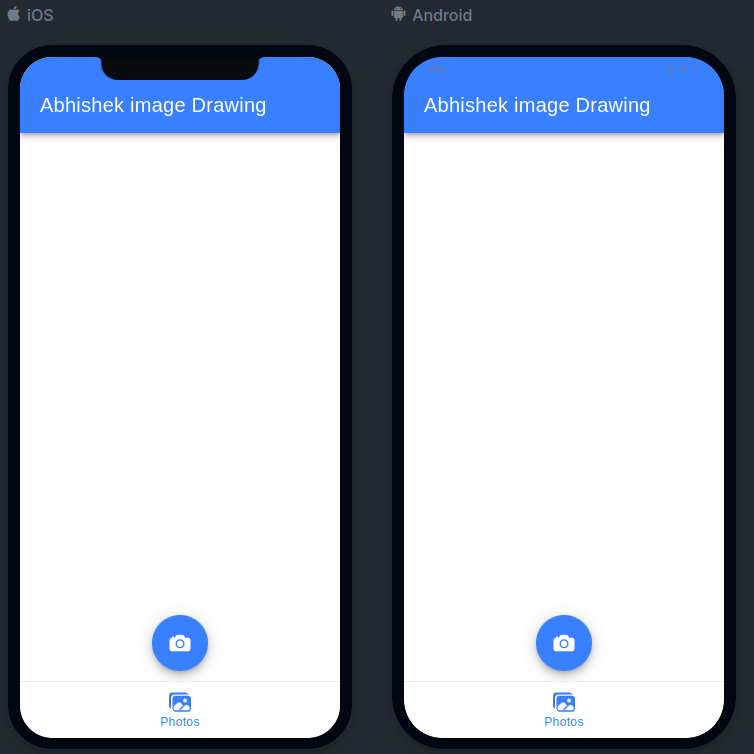

# Abhishek_Image_Anotate

## Description
**Abhishek Image Annotate** is a feature-rich Ionic mobile application designed to enhance your photo-editing experience. With this app, you can effortlessly capture photos and annotate them with text, drawings, and other elements to add context and creativity to your images.

Key Features:
1. **Photo Capture:** Use your device's camera to take pictures directly within the app.

2. **Annotation Tools:** Add annotations to your photos to highlight important details or express your creativity.

4. **Drawing Tools:** Freehand draw on your photos to add personal touches and emphasize specific areas with different sizes.

5. **Export Options:** Easily save and share your annotated images via email, social media, or your device's gallery.

"Abhishek Image Annotate" is the ideal tool for users who want to add a personal touch to their photos before sharing or saving them. Whether you're annotating images for work, school, or personal use, this app makes it quick and simple.
To run an Ionic app, you can follow these single-line steps in your command line interface:

## Documentation

1. Install dependencies using npm or yarn:
   ```
   npm install
   ```
   or
   ```
   yarn install
   ```

2. Build the Ionic app:
   ```
   ionic build
   ```

3. Serve the app and open it in Ionic Lab:
   ```
   ionic serve --lab
   ```


## Demo

Home screen:


Camera screen:


Preview screen:


Annotation screen:


